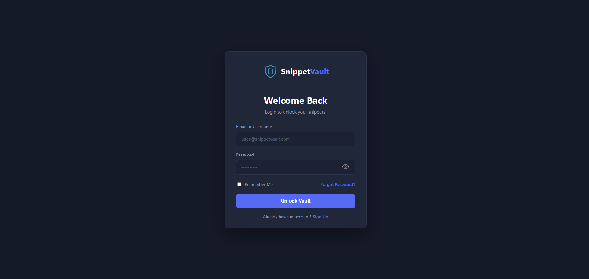
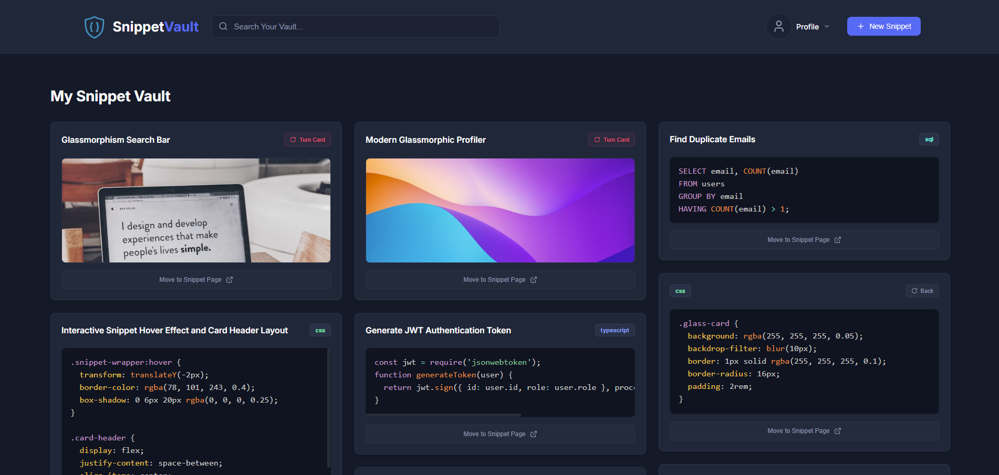
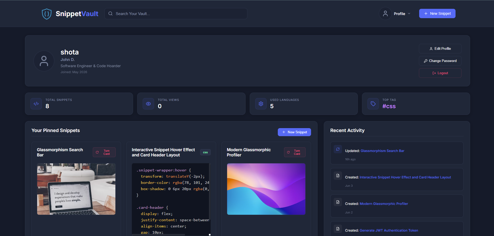
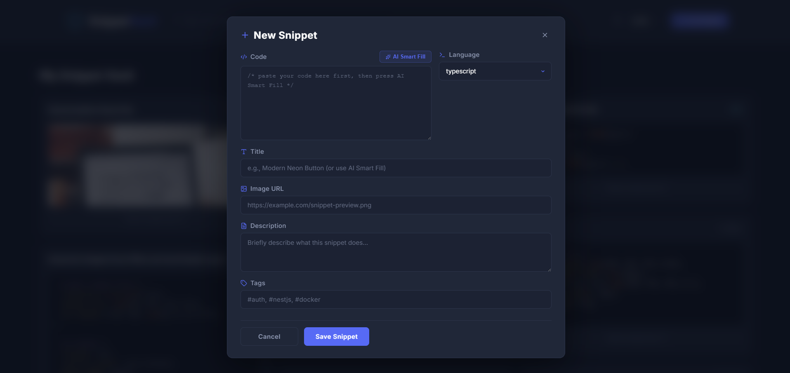

# 🔒 SnippetVault

<div align="center">

**თანამედროვე, Full-Stack კოდის სნიპეტების მენეჯმენტის პლატფორმა AI ინტეგრაციით**






</div>

---

## 📖 პროექტის შესახებ

**SnippetVault** არის სრულფასოვანი Full-Stack ვებ-აპლიკაცია, რომელიც შექმნილია კოდის სნიპეტების **უსაფრთხოდ შენახვის, ორგანიზებისა და მართვისთვის**. პროექტი გამოირჩევა დახვეწილი, პრემიუმ მინიმალისტური კრემისფერი/ბეჟი (Glassmorphism) დიზაინით და ინტეგრირებული აქვს Gemini AI კოდის ანალიზისა და ავტომატური შევსებისთვის.

---

## ✨ ფუნქციონალი

| ფუნქცია                         | აღწერა                                                               |
| ------------------------------- | -------------------------------------------------------------------- |
| 🔐 **უსაფრთხო ავტორიზაცია**     | JWT ტოკენებზე დაფუძნებული სისტემა და bcrypt-ით დაჰეშირებული პაროლები |
| 📂 **სრული CRUD**               | სნიპეტების შექმნა, წაკითხვა, განახლება და წაშლა                      |
| 🧠 **AI Smart Fill & Analysis** | Gemini AI-ით ავტომატური შევსება და კოდის სრულფასოვანი ანალიზი        |
| 🔍 **სმარტ ძებნა**              | ძებნა სათაურით, შიგთავსით, ენებითა და #tags-ებით                     |
| 🎨 **Premium Minimalist UI**    | Glassmorphism სტილი, Lucide React იკონები, Prism.js ჰაილაითინგი      |
| 📊 **პერსონალური სტატისტიკა**   | დინამიური სტატისტიკა — სნიპეტები, ნახვები, ტოპ თეგები, Timeline      |

---

## 🚀 Tech Stack

### Frontend

- ⚛️ **React** (TypeScript)
- 🔀 **React Router Dom** — კომპონენტების როუტინგი
- 🎨 **Lucide React** — პრემიუმ იკონოგრაფია
- ✨ **Prism.js** — კოდის სინტაქსის პროფესიონალური ჰაილაითინგი
- 📝 **React Markdown** — AI-ის პასუხების ლამაზი ფორმატირება
- 📡 **Axios** — HTTP მოთხოვნები და JWT ინტერცეპტორები

### Backend

- 🏗️ **NestJS** (TypeScript) — სკალირებადი, არქიტექტურულად გამართული ფრეიმვორკი
- 🔷 **Prisma ORM** — მონაცემთა ბაზასთან ტიპიზირებული და უსაფრთხო მუშაობა
- 🍃 **MongoDB** — სნიპეტებისა და მომხმარებლების შენახვა
- 🛡️ **Passport.js & JWT** — უსაფრთხო ავტორიზაცია

---

## 📁 პროექტის სტრუქტურა

```
SnippetVault/
├── backend/
│   ├── src/
│   │   ├── auth/               # ავტორიზაციის მოდული (JWT, Login, Register)
│   │   ├── users/              # იუზერების მართვის სერვისები და კონტროლერები
│   │   ├── snippets/           # სნიპეტების CRUD და Prisma Data Mapping ლოგიკა
│   │   ├── ai/                 # Gemini AI Smart Fill და კოდის ახსნის სერვისი
│   │   ├── prisma.service.ts
│   │   └── main.ts
│   └── prisma/
│       └── schema.prisma       # MongoDB სქემები (User, Snippet მოდელები)
│
└── frontend/
    └── src/
        ├── api/                # Axios კონფიგურაცია და API სერვისები
        ├── assets/             # ლოგო და სტატიკური ფაილები
        ├── components/         # მრავალჯერადი კომპონენტები (Modal, SnippetCard...)
        ├── pages/              # აპლიკაციის გვერდები (Dashboard, Profile, SnippetPage...)
        └── App.tsx
```

---

## 🛠️ გაშვების ინსტრუქცია

### წინაპირობები

დარწმუნდით, რომ სისტემაში დაყენებული გაქვთ:

- [Node.js](https://nodejs.org/) (v18+)
- [npm](https://www.npmjs.com/)
- [MongoDB](https://www.mongodb.com/) (ლოკალური ან MongoDB Atlas)

---

### 1️⃣ რეპოზიტორიის კლონირება

```bash
git clone https://github.com/ShotikoLabadze/SnippetVault.git
cd SnippetVault
```

---

### 2️⃣ Backend-ის გამართვა

```bash
cd backend
npm install
```

შექმენით `.env` ფაილი `backend/` დირექტორიაში და შეავსეთ შემდეგი მნიშვნელობებით:

```env
DATABASE_URL="YOUR_MONGODB_CONNECTION_STRING"
JWT_SECRET="YOUR_SUPER_SECRET_KEY"
GEMINI_API_KEY="YOUR_GEMINI_API_KEY"
```

გაუშვით Prisma-ს გენერატორი და ჩართეთ სერვერი:

```bash
npx prisma generate
npm run start:dev
```

> ✅ ბექენდი სტანდარტულად ჩაირთვება მისამართზე: `http://localhost:3000`

---

### 3️⃣ Frontend-ის გამართვა

გახსენით ახალი ტერმინალი:

```bash
cd frontend
npm install
npm run dev
```

> ✅ ფრონტენდი სტანდარტულად ჩაირთვება მისამართზე: `http://localhost:5173`

---

## 🔒 უსაფრთხოება და ოპტიმიზაცია

- **Safe Data Mapping** — Prisma-ს განახლების ლოგიკა ოპტიმიზირებულია `undefined` Payload Mapping-ით, რაც ხელს უშლის მონაცემების არასწორად გადაწერას.
- **Error Handling** — ბექენდზე რეალიზებულია უსაფრთხო `try/catch` ბლოკები, რომლებიც დააბრუნებენ ზუსტ HTTP სტატუს კოდებს (მაგ. `404 NotFoundException`, `400 BadRequestException`).
- **Responsive Design** — ინტერფეისი სრულად ადაპტირებულია ნებისმიერი ზომის ეკრანზე (მობილური, ტაბლეტი, დესკტოპი).
- **JWT Security** — ყველა პროტექტირებული მარშრუტი ამოწმებს ტოკენის ვალიდურობას Passport.js Guards-ის მეშვეობით.

---

## 📝 ლიცენზია

პროექტი ვრცელდება **MIT** ლიცენზიით. იხილეთ [LICENSE](./LICENSE) ფაილი დეტალებისთვის.

---

<div align="center">

შექმნილია ❤️-ით — [ShotikoLabadze](https://github.com/ShotikoLabadze)

</div>
